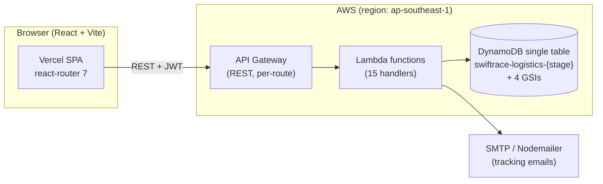
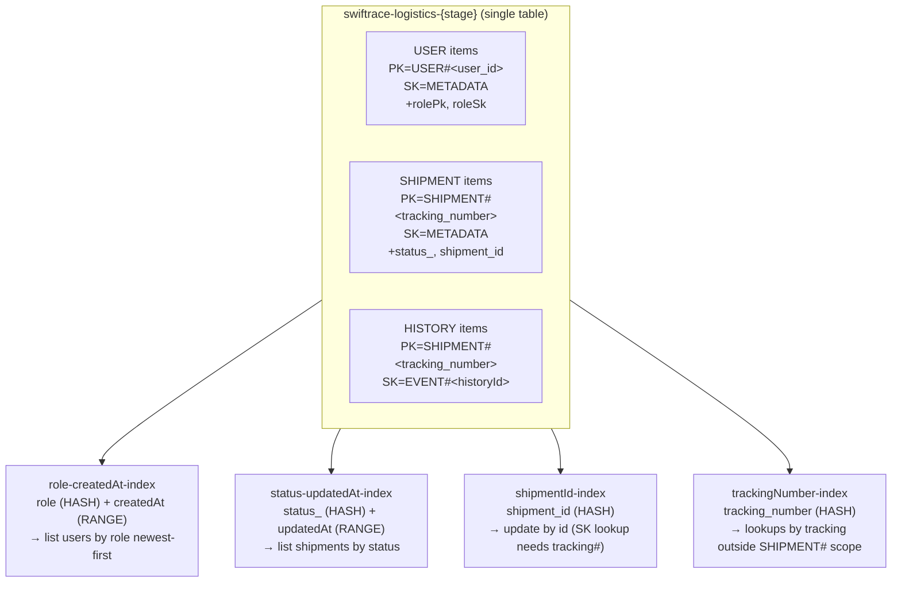
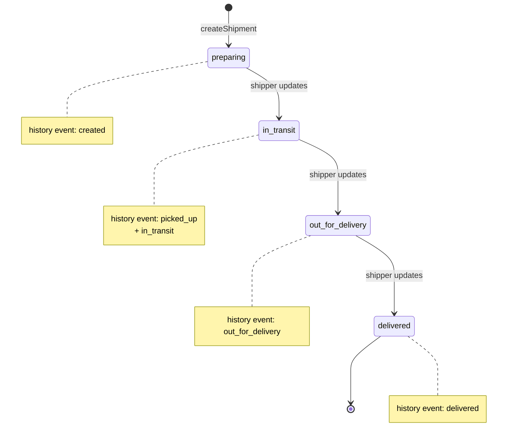

# SwiftRace

> A serverless logistics tracking platform — customers, shippers, and admins coordinate shipments through a tracking number and a clean event timeline.

SwiftRace is a small but production-shaped logistics system: customers place sample orders, shippers progress them through a four-stage delivery lifecycle, admins verify status changes, and recipients track packages by tracking number. Every state change writes an immutable history event so you always have a paper trail of what happened to a shipment and when.

🌐 **Live demo:** [swiftrace.vercel.app](https://swiftrace.vercel.app)

---

## Table of Contents

1. [What It Does](#what-it-does)
2. [System Architecture](#system-architecture)
3. [Tech Stack](#tech-stack)
4. [Repository Layout](#repository-layout)
5. [Database Design](#database-design)
6. [API Reference](#api-reference)
7. [Shipment Lifecycle](#shipment-lifecycle)
8. [Roles & Verification](#roles--verification)
9. [Deployment](#deployment)
10. [Local Development](#local-development)
11. [Environment Variables](#environment-variables)

---

## What It Does

- **Place sample orders** — a `placeSampleOrder` flow stands up a complete demo shipment in one call (useful for testing and onboarding).
- **Create real shipments** with origin, destination, customer, and a generated tracking number.
- **Update shipment status** through four lifecycle stages: `preparing → in_transit → out_for_delivery → delivered`.
- **Track by tracking number** — public-facing endpoint for recipients; returns the shipment plus a sanitized history timeline.
- **Email tracking links** to recipients on demand.
- **Verify history events** as an admin — internal `admin_verified` flag is hidden from public history responses.
- **Filter shipments** by status (admin/shipper view) or by customer (customer view).
- **Three user roles** with verification gating — new shippers and admins need approval before they can act.

---

## System Architecture



**Why Serverless Framework?** SwiftRace's backend is shaped as **fifteen independent HTTP-triggered Lambdas** rather than one router-Lambda — each function does one thing (`createShipment`, `getShipmentByTracking`, etc.) and `serverless.yml` declares the route + IAM + timeout for each. Deployment is a single `serverless deploy` and rollbacks are per-function.

**Single-table DynamoDB** keeps shipment metadata, history events, and users in one table with PK/SK prefixes. Four GSIs cover the read patterns: by role, by status, by shipment ID, and by tracking number.

---

## Tech Stack

| Layer | Backend | Frontend |
|---|---|---|
| Language | TypeScript 5, Node.js 20 | TypeScript 5, React 19 |
| Runtime | AWS Lambda | Browser (Vercel) |
| Framework | Serverless Framework v3 | Vite 8 |
| HTTP | API Gateway REST | `fetch` |
| Data | DynamoDB via `aws-sdk` v2 (`DocumentClient`) | — |
| Auth | JWT (`jsonwebtoken`) + bcrypt-style hashing in `utils/password.ts` | localStorage `authToken` |
| Validation | yup | — |
| Email | nodemailer | — |
| Routing | `serverless.yml` per-function HTTP events | react-router-dom 7 |
| Styling | — | Plain CSS modules (no Tailwind) |
| Deploy plugin | `serverless-dotenv-plugin` | Vercel |

---

## Repository Layout

This is a **monorepo**: backend Lambdas and the frontend SPA live in the same repository.

```
swiftrace/
├── backend/
│   ├── package.json                 # AWS SDK v2, JWT, nodemailer, yup
│   ├── serverless.yml               # 15 functions + 1 DynamoDB table + 4 GSIs
│   ├── tsconfig.json
│   ├── seed.ts                      # Local seeder
│   ├── clear.ts                     # Local DB clear
│   ├── config/
│   │   ├── config.ts
│   │   └── db.ts                    # DocumentClient
│   └── src/
│       ├── handler.ts               # Main entry (1-line stub - functions are direct)
│       ├── functions/
│       │   ├── user/                # createUser, loginUser, updateUser,
│       │   │                        # deleteUser, getUserByRole
│       │   ├── shipment/            # createShipment, updateShipment,
│       │   │                        # getShipmentByTracking, getShipmentByStatus,
│       │   │                        # getShipmentHistory, placeSampleOrder,
│       │   │                        # sendTrackingEmail
│       │   └── dev/                 # seedDatabase, clearDatabase (HTTP)
│       ├── service/
│       │   └── dynamodb.ts          # Single DynamoDBService class —
│       │                             #   users + shipments + history
│       ├── types/
│       │   ├── user.ts              # USER_ROLES, verification statuses
│       │   ├── shipment.ts          # SHIPMENT_STATUS lifecycle
│       │   └── history.ts           # SHIPMENT_HISTORY_TYPES events
│       ├── utils/
│       │   ├── auth.ts, jwt.ts, password.ts
│       │   ├── email.ts
│       │   ├── env.ts
│       │   ├── error-handler.ts
│       │   ├── parse.ts, user.ts
│       └── validation/              # yup schemas (shipment, user)
└── frontend/
    ├── package.json                 # React 19, Vite 8, react-router 7
    ├── vite.config.js
    ├── vercel.json
    ├── public/                      # favicon, icons sprite sheet
    └── src/
        ├── App.tsx                  # Login → ProtectedRoute → Dashboard
        ├── App.css
        ├── main.tsx
        ├── index.css
        ├── assets/                  # Logo (light/dark), drone GIF, robot GIF
        ├── components/
        │   ├── LoginPage/
        │   ├── HeroSection/
        │   ├── AdminSection/
        │   ├── SampleOrderSection/
        │   ├── ShipmentUpdateSection/
        │   ├── UsersView/
        │   ├── Sidebar/
        │   ├── ConsoleSection.tsx, FlowSection.tsx
        │   ├── Dashboard.tsx, ShipmentsView.tsx
        │   ├── DevTools.tsx, Footer.tsx, Topbar.tsx
        │   ├── ThemeToggle.tsx, UserDropdown.tsx
        │   ├── ProtectedRoute.tsx, ErrorBoundary.tsx
        │   └── Logo.tsx, Illustration.tsx
        ├── contexts/                # ThemeContext + useTheme hook
        ├── types/api.ts
        └── utils/
            ├── auth.ts
            └── chartTheme.ts
```

---

## Database Design

SwiftRace uses **DynamoDB single-table design**. One table stores users, shipments, and shipment history events; four global secondary indexes cover the read patterns the API needs.



**Notable design choices:**

- **Tracking number is the partition key** for shipments because every customer-facing read is "look up shipment X by tracking". Public reads need zero GSI hops.
- **History events sit under the same partition** as the parent shipment (`SK=EVENT#<historyId>`), so a single `Query` returns the full timeline ordered by event ID.
- **`status_` is stored prefixed** (`STATUS#in_transit`) inside the GSI to avoid hot-partitioning on a single status value across the whole table. The service layer transparently strips the prefix on read.
- **`PAY_PER_REQUEST` billing** keeps cost proportional to traffic — fine for a portfolio app and predictable for production loads in the low thousands of requests.

### Domain types (TypeScript)

```typescript
// Roles + verification
const USER_ROLES = ["customer", "shipper", "admin"] as const;
const USER_VERIFICATION_STATUSES = ["pending", "verified", "rejected"] as const;

interface User {
  user_id: string;
  name: string;
  email: string;
  phone?: string;
  role: UserRole;
  verification_status: UserVerificationStatus;
  verifiedAt?: string;
  verifiedBy?: string;          // user_id of admin who verified
  password_hash: string;        // never returned via API
  createdAt: string;
  updatedAt: string;
}

// Shipment lifecycle
const SHIPMENT_STATUS = [
  "preparing", "in_transit", "out_for_delivery", "delivered"
] as const;

interface Shipment {
  shipment_id: string;
  customer_id: string;
  customer_name: string;
  product_name: "sample";       // demo dataset is sample-only
  tracking_number: string;
  origin: string;
  destination: string;
  current_location?: string;
  status_: ShipmentStatus;
  createdAt: string;
  updatedAt: string;
}

// History timeline
const SHIPMENT_HISTORY_TYPES = [
  "created", "picked_up", "in_transit", "out_for_delivery", "delivered"
] as const;

interface ShipmentHistoryItem {
  tracking_number: string;
  historyId: string;
  historyType: ShipmentHistoryType;
  historyAt: string;
  status?: ShipmentStatus;
  current_location?: string;
  details?: string;
  admin_verified?: boolean;     // hidden from public responses
  verifiedAt?: string;
  verifiedBy?: string;
}
```

The repo's `getShipmentHistoryForUser` returns `ShipmentHistoryResponse` (a stripped variant of `ShipmentHistoryItem`) that hides `admin_verified` / `verifiedAt` / `verifiedBy` so customers don't see internal moderation metadata.

---

## API Reference

| Method | Path | Purpose |
|---|---|---|
| `POST` | `/users` | Register a user (default role `customer`) |
| `POST` | `/auth/login` | Email + password → JWT |
| `PUT` | `/users/{user_id}` | Update name / phone / role / verification |
| `DELETE` | `/users/{user_id}` | Remove a user |
| `GET` | `/users` | List users by role (`?role=customer\|shipper\|admin`) |
| `POST` | `/orders/sample` | Place a sample order (demo helper) |
| `POST` | `/shipments` | Create a real shipment |
| `PUT` | `/shipments/{shipment_id}` | Update status / current_location |
| `GET` | `/shipments/tracking/{tracking_number}` | Public lookup by tracking number |
| `GET` | `/shipments/{tracking_number}/history` | Sanitized event timeline (public) |
| `GET` | `/shipments/status/{status_}` | Internal: shipments at a given status |
| `POST` | `/shipments/tracking/email` | Email a tracking link to a customer |
| `POST` | `/dev/seed` | Bulk seed demo data (gated) |
| `POST` | `/dev/clear` | Wipe table contents (gated) |

Every endpoint enables CORS at the API Gateway level, returns JSON, and authorized routes expect `Authorization: Bearer <jwt>` (`utils/jwt.ts`).

---

## Shipment Lifecycle



Each transition writes a `ShipmentHistoryItem` row with the new status, `current_location`, and free-form `details`. The history is immutable — you never mutate a past event, you append a new one.

---

## Roles & Verification

| Role | Default verification | What they can do |
|---|---|---|
| **customer** | `verified` (auto) | Place sample orders, look up their own shipments by tracking, request email tracking links |
| **shipper** | `pending` (manual approval) | Update shipment status (preparing → delivered), see assigned shipments, view by status |
| **admin** | `pending` (manual approval) | Verify other shippers/admins, manage users, see all shipments by status, run dev seed/clear |

`verification_status` defaults to `pending` for shippers/admins on registration. Until an admin flips it to `verified`, they can authenticate but most write actions are blocked.

---

## Deployment

### Backend → AWS Lambda via Serverless Framework

Defined in `backend/serverless.yml`:

- **Region:** `ap-southeast-1` (default; override with `--region`).
- **Stage:** `${opt:stage, 'dev'}` (override with `--stage prod`).
- **Runtime:** `nodejs20.x`.
- **Functions:** 15 — five user, seven shipment, two dev, plus the implicit handler.
- **DynamoDB:** the `LogisticsTable` resource is provisioned alongside the functions so a single `serverless deploy` brings up infrastructure and code together.
- **IAM:** scoped to DynamoDB CRUD on the table + all GSIs.
- **Per-function timeout:** 29 seconds (just under API Gateway's 30s limit).

Deploy:

```bash
cd backend
npm install
npm run build
npx serverless deploy --stage prod
```

`serverless-dotenv-plugin` injects `.env` values (or env vars) into Lambda environment.

### Frontend → Vercel

```bash
cd frontend
npm install
npm run build
# `vercel --prod` or auto-deploy on push to main
```

`vercel.json` covers SPA fallback routing.

---

## Local Development

### Backend

```bash
cd backend
npm install
# Build TypeScript
npm run build

# Seed local DynamoDB (e.g. dynamodb-local) with demo data
npm run seed

# Wipe demo data
npm run clear
```

Local Lambda execution can be done via `serverless invoke local --function createShipment --path event.json` or Serverless Offline. There's no traditional `npm run dev` server because the backend is purely event-driven Lambdas.

### Frontend

```bash
cd frontend
npm install
npm run dev          # Vite + HMR on port 5173 by default
npm run lint         # ESLint
npm run build        # Production bundle
npm run preview      # Serve dist/ locally
```

Set `VITE_API_BASE` in `frontend/.env` to your API Gateway URL.

---

## Environment Variables

### Backend (`.env` consumed by `serverless-dotenv-plugin`)

```env
# DynamoDB
LOGISTICS_DYNAMO_TABLE=swiftrace-logistics-dev
SHIPMENT_DYNAMO_TABLE=swiftrace-logistics-dev   # defaults to LOGISTICS_DYNAMO_TABLE

# Auth
JWT_SECRET=...
JWT_EXPIRES_IN=7d

# Email (tracking links)
EMAIL_USER=...
EMAIL_PASS=...

# Domain default
DEFAULT_ORIGIN=Warehouse
```

### Frontend (`frontend/.env`)

```env
VITE_API_BASE=https://<api-id>.execute-api.ap-southeast-1.amazonaws.com/dev
```

---

## Author

Built by [Asciente-rks](https://github.com/Asciente-rks). Live demo at **[swiftrace.vercel.app](https://swiftrace.vercel.app)**.
