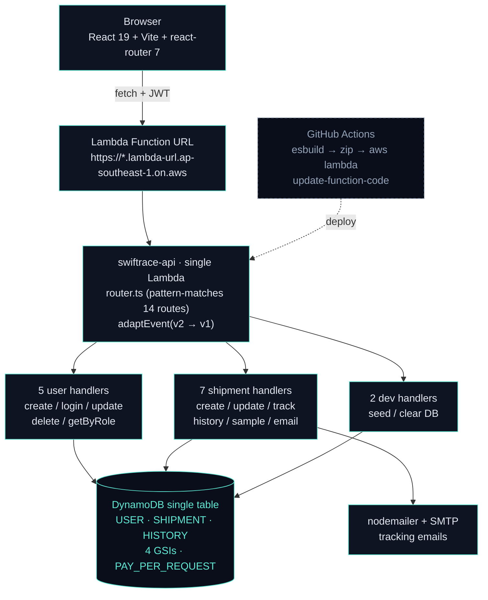
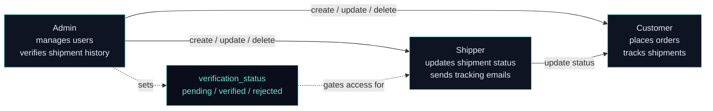
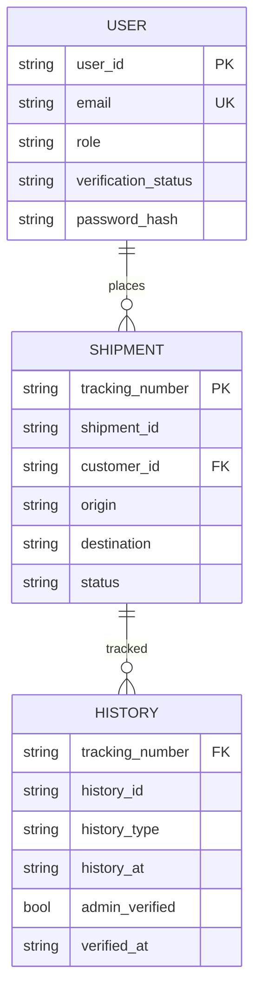
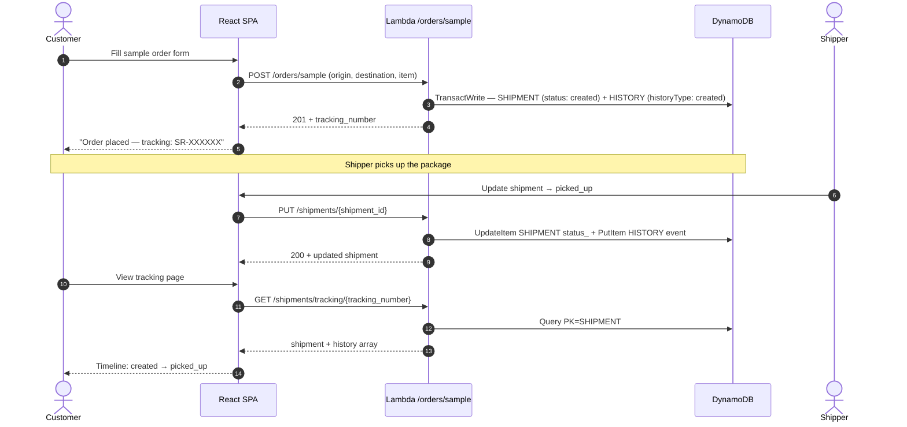
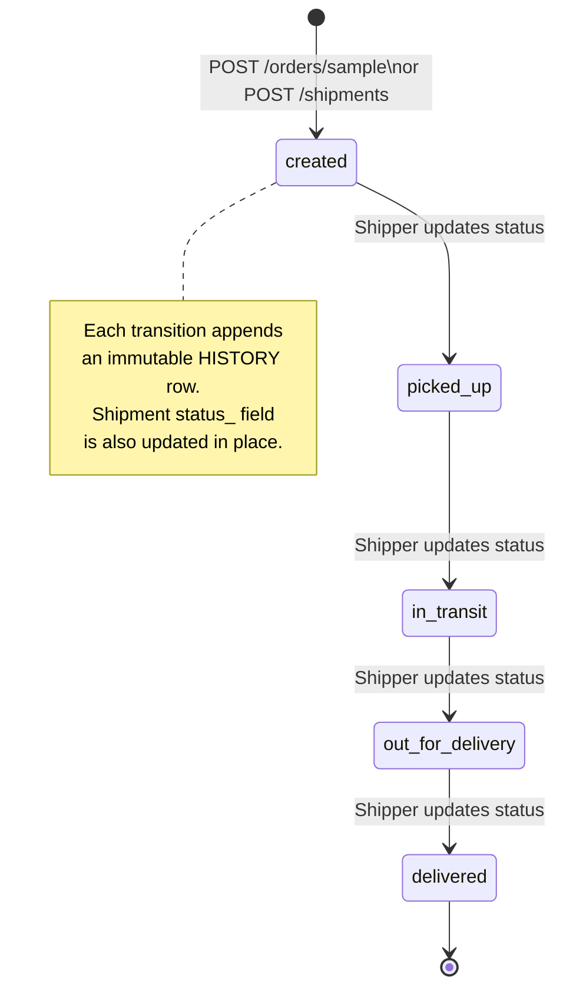
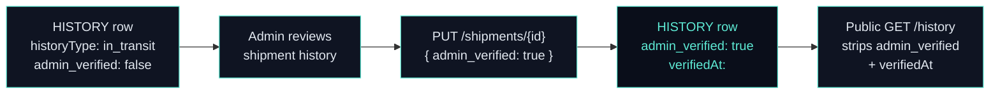
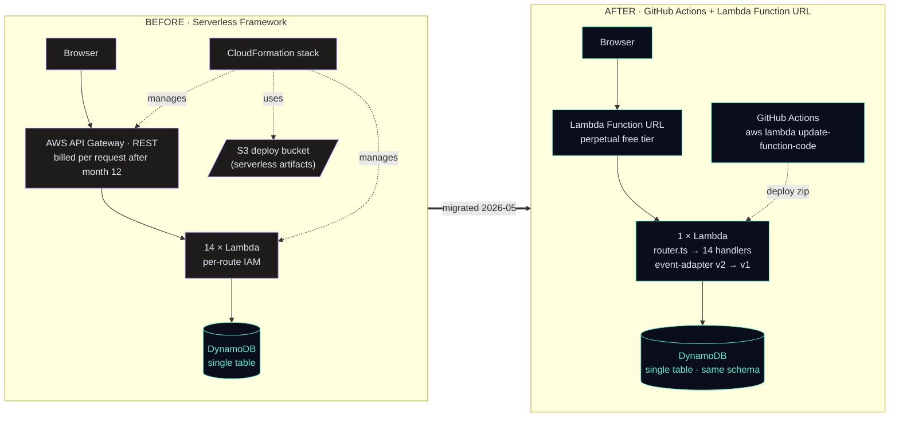

# SwiftRace

> A serverless logistics tracking platform — customers place sample orders, shippers progress them through a four-stage delivery lifecycle, admins verify status changes.

SwiftRace is a serverless logistics tracking app with a clean three-role shape: customers place orders and track shipments, shippers move them through `picked_up → in_transit → out_for_delivery → delivered`, and admins verify every status transition. A single AWS Lambda exposed via Function URL fans out internally to 14 handler functions. DynamoDB single-table design, React 19 + Vite frontend, immutable history timeline per shipment. Deployed straight from GitHub Actions to Lambda — no API Gateway, no S3 deploy bucket, no CloudFormation. $0/month forever, no 12-month timer.

In May 2026, SwiftRace was migrated off Serverless Framework + API Gateway onto a thinner GitHub Actions → Lambda Function URL pipeline. Every handler kept its source unchanged; the conversion lives entirely in `router.ts`, `event-adapter.ts`, `scripts/deploy.sh`, and `.github/workflows/deploy-backend.yml`.

---

## Live Demo

- **Live app:** https://swiftrace.vercel.app/
- **Backend:** AWS Lambda Function URL (`ap-southeast-1`)
- **Source:** https://github.com/Asciente-rks/swiftrace

> Cold start may take 1-2 seconds on the first request; subsequent requests are warm.

---

## Table of Contents

1. [What It Does](#what-it-does)
2. [Architecture](#architecture)
3. [Role Hierarchy](#role-hierarchy)
4. [Tech Stack](#tech-stack)
5. [Database Design](#database-design)
6. [Repository Layout](#repository-layout)
7. [API Reference](#api-reference)
8. [Shipment Lifecycle Flows](#shipment-lifecycle-flows)
9. [Migration: Serverless Framework → Lambda Function URL](#migration-serverless-framework--lambda-function-url)
10. [Security](#security)
11. [Deployment & Environment Variables](#deployment--environment-variables)
12. [Cost Breakdown](#cost-breakdown)
13. [Local Development](#local-development)
14. [Author](#author)

---

## What It Does

- **Customer orders** — customers log in, place a sample order via the *Place Order* helper (pre-populated origin, destination, item type), and get a tracking number immediately. The `placeSampleOrder` handler creates the `SHIPMENT` row and the initial `HISTORY` event in one DynamoDB `TransactWrite`.
- **Four-stage delivery lifecycle** — shippers see every shipment and update status through `picked_up → in_transit → out_for_delivery → delivered`. Each status update appends an immutable `HISTORY` event under the same partition key as the shipment — a single Query returns the full timeline.
- **Admin verification** — admins see a `verified` flag on each status transition and can mark it confirmed. The `admin_verified` field is stored on each `HISTORY` row but stripped from public-facing history responses so customers never see internal moderation metadata.
- **Immutable history timeline** — every status change is a new `HISTORY` row, never an overwrite. The shipment details page renders the full chain chronologically.
- **Tracking email** — shippers or the system can trigger a `POST /shipments/tracking/email` to send the customer a nodemailer email with their current tracking status.
- **Tracking by number** — `GET /shipments/tracking/{tracking_number}` is a public-ish read keyed directly on the partition — no GSI hop needed for the most common read pattern.
- **Role-based dashboard** — customers see their own shipments; shippers see all shipments filterable by status; admins get the Users tab for managing shipper/admin accounts.
- **User lifecycle** — admins create accounts, set roles (`customer / shipper / admin`), and toggle a `verification_status` (`pending / verified / rejected`) to gate shipper access.
- **Dev helpers** — `POST /dev/seed` and `POST /dev/clear` populate/wipe the table for demo resets; these handlers are compiled in but should be disabled in production by removing the env secret or guard.

---

## Architecture



### Notable architectural choices

- **Single-Lambda router fan-out, not 14 separate Lambdas.** `router.ts` pattern-matches the `rawPath` + HTTP method and dispatches to the matching handler under `src/functions/**`. One cold start per warm container instead of 14; simpler IAM; same $0 bill.
- **Function URL replaces API Gateway entirely** — perpetual free tier, no per-request fee after month 12. This was the primary driver of the May 2026 migration.
- **`event-adapter.ts` translates Function URL events (payload v2.0)** into the `APIGatewayProxyEvent` (v1.0) shape every handler was originally written against — zero handler-code churn during the migration.
- **Tracking number as the partition key** — every customer-facing read is "look up shipment X by tracking" — public reads need zero GSI hops.
- **History events co-located with the parent shipment** — `PK: SHIPMENT#<tracking_number>`, `SK: EVENT#<historyId>`. A single `Query` returns the full timeline.
- **Idempotent provisioning** — `scripts/deploy.sh` checks each resource (`describe-table`, `get-function`, etc.) before creating it. Re-runs are safe; the "first deploy creates everything" path is the same code as the "1000th deploy updates code" path.

---

## Role Hierarchy



| Role | Created by | Key permissions |
|------|-----------|-----------------|
| `admin` | Seed script or another admin | Create/update/delete users, verify shipment history, all shipment reads |
| `shipper` | Admin | Update shipment status, send tracking emails, read all shipments by status |
| `customer` | Admin or self-register | Place orders, track own shipments by tracking number, view own history |

**`verification_status` on USER:**

| Value | Meaning |
|-------|---------|
| `pending` | Newly created account; shipper access gated |
| `verified` | Admin-approved; shipper can update statuses |
| `rejected` | Admin-rejected; treated as inactive |

---

## Tech Stack

### Backend

| Layer | Technology | Why |
|-------|-----------|-----|
| Runtime | Node.js 20 + TypeScript 5 | Latest Node LTS on Lambda |
| Framework | None — single Lambda + `router.ts` | One cold start, ~150 LOC routing |
| Bundler | **esbuild** | Sub-second builds; outputs a single `index.js` zip |
| Database | **DynamoDB single-table** (`aws-sdk` v2 DocumentClient) | 25 GB free perpetually; single-digit ms latency |
| Auth | JWT (`jsonwebtoken`) + scrypt (Node `crypto`) | Stateless; password hash never returned by API |
| Validation | **Yup** | Shape + field validation on user and shipment inputs |
| Email | nodemailer + SMTP | Free with Gmail / any SMTP provider |
| Event adapter | `event-adapter.ts` | Translates Function URL v2 events → APIGatewayProxyEvent v1 shape |

### Cloud · AWS

| Service | Purpose |
|---------|---------|
| AWS Lambda + Function URL | Single function, perpetual free tier, no API Gateway |
| DynamoDB (PAY_PER_REQUEST) | Single table, 4 GSIs, no provisioned capacity |
| CloudWatch Logs | Lambda execution logs |
| IAM (single execution role) | Scoped inline policy — DynamoDB + CloudWatch only |

### CI/CD

| Tool | Purpose |
|------|---------|
| GitHub Actions (`deploy-backend.yml`) | On push to `main`: esbuild → zip → `aws lambda update-function-code` |
| `scripts/deploy.sh` | Idempotent bash — provisions table, role, function, URL on first run; only uploads code on subsequent runs |
| `aws-actions/configure-aws-credentials` | OIDC-based credential injection; no long-lived keys in secrets |

### Frontend

| Layer | Technology | Why |
|-------|-----------|-----|
| Framework | React 19 + TypeScript 5 | Latest React, concurrent features |
| Build | Vite 8 | Sub-second HMR |
| Routing | react-router-dom 7 | Nested layouts, protected routes |
| HTTP | `fetch` (native) | No axios needed |
| Styling | CSS modules + `App.css` | Light/dark theme via `ThemeContext` |
| Hosting | **Vercel** | Hobby tier free, global CDN |

---

## Database Design

DynamoDB single-table design. One table (`swiftrace-logistics`) stores users, shipments, and shipment history events; four GSIs cover the read patterns. The same schema is provisioned on first deploy by `aws dynamodb create-table` inside `scripts/deploy.sh` — no Serverless / CloudFormation involvement.



### Table: `swiftrace-logistics`

Provisioned with `BillingMode: PAY_PER_REQUEST` (no fixed RCU/WCU costs).

#### USER

`PK: USER#<user_id>` · `SK: METADATA`

| Column | Type | Notes |
|--------|------|-------|
| `user_id` | String | UUID |
| `email` | String | Login key |
| `role` | String | `customer / shipper / admin` |
| `verification_status` | String | `pending / verified / rejected` |
| `password_hash` | String | scrypt; never returned via API |

#### SHIPMENT

`PK: SHIPMENT#<tracking_number>` · `SK: METADATA`

| Column | Type | Notes |
|--------|------|-------|
| `shipment_id` | String | UUID |
| `tracking_number` | String | Unique, primary lookup key |
| `origin` | String | |
| `destination` | String | |
| `status_` | String | `STATUS#<status>` in storage; plain status in API responses |

#### HISTORY

`PK: SHIPMENT#<tracking_number>` · `SK: EVENT#<historyId>`

| Column | Type | Notes |
|--------|------|-------|
| `historyType` | String | `created / picked_up / in_transit / out_for_delivery / delivered` |
| `admin_verified` | Boolean | Internal — stripped from public history responses |
| `verifiedAt` | String | Also stripped from public responses |

### Global Secondary Indexes (4 GSIs)

| Index | Purpose |
|-------|---------|
| GSI on `customer_id` | List all shipments for a given customer |
| GSI on `status_` | List all shipments by delivery status (shipper dashboard) |
| GSI on `email` | User lookup by email at login |
| GSI on `role` | List all users by role (admin users tab) |

**Notable design choices:**

- **Tracking number as partition key** — the most common read ("look up shipment by tracking number") is a direct `GetItem` or `Query` on the base table with no GSI hop.
- **History co-located with shipment** — `PK: SHIPMENT#<tracking>`, `SK: EVENT#<historyId>`. A single `Query(PK)` returns the shipment metadata + all history events; the frontend splits them client-side by SK prefix.
- **`status_` prefix in storage** — `STATUS#in_transit` instead of `in_transit` — prevents accidental equality matches on GSI queries when `status` is a reserved word in some DynamoDB expression contexts.
- **`admin_verified` stripped in public responses** — `ShipmentHistoryResponse` type omits `admin_verified` and `verifiedAt`. Customers and shippers never see internal moderation state.

---

## Repository Layout

```
swiftrace/
├── .github/workflows/deploy-backend.yml  # esbuild → zip → lambda update-function-code
├── backend/
│   ├── package.json                       # Node 20, esbuild, aws-sdk v2, JWT, Yup
│   ├── tsconfig.json
│   ├── build.mjs                          # esbuild script → dist/index.js
│   ├── seed.ts                            # Bootstrap sample data via ts-node
│   ├── clear.ts                           # Wipe table via ts-node
│   ├── .env.example                       # All env vars documented
│   ├── config/
│   │   ├── config.ts                      # Env var exports
│   │   └── db.ts                          # DynamoDB DocumentClient singleton
│   ├── scripts/deploy.sh                  # Idempotent infra + code deploy (~300 lines)
│   └── src/
│       ├── router.ts                      # Single Lambda entry point · 14-route pattern matcher
│       ├── functions/
│       │   ├── user/                      # createUser · loginUser · updateUser · deleteUser · getUserByRole
│       │   ├── shipment/                  # createShipment · updateShipment · placeSampleOrder ·
│       │   │                              # getShipmentByTracking · getShipmentByStatus ·
│       │   │                              # getShipmentHistory · sendTrackingEmail
│       │   └── dev/                       # seedDatabase · clearDatabase
│       ├── service/
│       │   └── dynamodb.ts                # All DynamoDB read/write operations (12 KB)
│       ├── types/
│       │   ├── user.ts                    # User, UserRole, VerificationStatus
│       │   ├── shipment.ts                # Shipment, ShipmentStatus, ShipmentResponse
│       │   └── history.ts                 # HistoryEvent, ShipmentHistoryResponse (stripped)
│       ├── utils/
│       │   ├── auth.ts                    # JWT verify middleware
│       │   ├── email.ts                   # nodemailer transporter factory
│       │   ├── env.ts                     # Typed env var access
│       │   ├── error-handler.ts           # CORS headers + error response helpers
│       │   ├── event-adapter.ts           # Function URL v2 → APIGatewayProxyEvent v1
│       │   ├── jwt.ts                     # sign + verify wrappers
│       │   ├── parse.ts                   # JSON body parser
│       │   ├── password.ts                # scrypt hash + timing-safe verify
│       │   ├── rate-limit.ts              # Per-actor rolling counter
│       │   └── user.ts                    # Role guard helpers
│       └── validation/
│           ├── shipment-validation.ts     # Yup schemas for shipment inputs
│           └── user-validation.ts         # Yup schemas for user inputs
└── frontend/
    ├── package.json                        # React 19, Vite 8, react-router 7
    ├── vite.config.js
    ├── vercel.json
    ├── public/favicon.svg
    └── src/
        ├── App.tsx                         # Routes + role guards
        ├── main.tsx
        ├── App.css                         # Light/dark theme variables
        ├── index.css
        ├── components/
        │   ├── Dashboard.tsx               # KPIs + recent shipments
        │   ├── ShipmentsView.tsx           # Shipper shipment list
        │   ├── ConsoleSection.tsx          # Shipment detail + history timeline
        │   ├── ShipmentUpdateSection/      # Status update form for shippers
        │   ├── SampleOrderSection/         # Sample order placement for customers
        │   ├── UsersView/                  # Admin user management
        │   ├── AdminSection/               # Admin controls
        │   ├── LoginPage/                  # Auth form
        │   ├── HeroSection/                # Landing hero
        │   ├── Sidebar/ · Topbar.tsx       # Navigation
        │   ├── FlowSection.tsx             # Lifecycle flow explainer
        │   ├── DevTools.tsx                # Seed/clear dev helpers UI
        │   ├── ThemeToggle.tsx             # Light/dark toggle
        │   ├── UserDropdown.tsx            # Profile + logout
        │   ├── ProtectedRoute.tsx          # Route guard by role
        │   └── ErrorBoundary.tsx
        ├── contexts/
        │   ├── ThemeContext.tsx            # Light/dark theme provider
        │   └── useTheme.ts
        ├── utils/
        │   ├── auth.ts                     # localStorage token helpers
        │   ├── chartTheme.ts               # Chart color palette per theme
        │   └── security.ts                 # XSS sanitization helpers
        └── types/api.ts                    # Shared API response types
```

---

## API Reference

### Auth & users

| Method | Path | Auth | Purpose |
|--------|------|------|---------|
| POST | `/auth/login` | none | Email + password → JWT |
| POST | `/users` | JWT (admin) | Create a new user account |
| GET | `/users` | JWT (admin/shipper) | List users filtered by `?role=` |
| PUT | `/users/{user_id}` | JWT (admin) | Update user fields, verification status, role |
| DELETE | `/users/{user_id}` | JWT (admin) | Permanently delete user |

### Shipments

| Method | Path | Auth | Purpose |
|--------|------|------|---------|
| POST | `/shipments` | JWT (admin/shipper) | Create a shipment (manual) |
| PUT | `/shipments/{shipment_id}` | JWT (shipper/admin) | Update status — appends HISTORY event |
| GET | `/shipments/tracking/{tracking_number}` | JWT | Fetch shipment by tracking number |
| GET | `/shipments/status/{status_}` | JWT (shipper/admin) | List all shipments with a given status |
| GET | `/shipments/{tracking_number}/history` | JWT | Full history timeline for a shipment |
| POST | `/shipments/tracking/email` | JWT | Send tracking email to customer |

### Orders

| Method | Path | Auth | Purpose |
|--------|------|------|---------|
| POST | `/orders/sample` | JWT (customer) | Place a sample order → creates SHIPMENT + initial HISTORY |

### Dev helpers

| Method | Path | Auth | Purpose |
|--------|------|------|---------|
| POST | `/dev/seed` | — | Seed table with sample users and shipments |
| POST | `/dev/clear` | — | Wipe all items from the table |

### Health

| Method | Path | Auth | Purpose |
|--------|------|------|---------|
| GET | `/` or `/health` | none | Lambda health check → `{ service: "swiftrace-api", message: "ok" }` |

---

## Shipment Lifecycle Flows

### Order placement and lifecycle



### Delivery status state machine



### Admin verification flow



---

## Migration: Serverless Framework → Lambda Function URL

In May 2026, SwiftRace was migrated off Serverless Framework + API Gateway + a Serverless-managed S3 deploy bucket + CloudFormation, and onto a thinner GitHub Actions → AWS Lambda Function URL pipeline. Every handler kept its source unchanged; the conversion lives entirely in `router.ts` (single Lambda fan-out), `event-adapter.ts` (v2 → v1 event shape), `scripts/deploy.sh` (idempotent provisioning), and `.github/workflows/deploy-backend.yml`.



### What changed

| Before | After |
|--------|-------|
| Serverless Framework v3 + `serverless.yml` | GitHub Actions workflow + `scripts/deploy.sh` |
| AWS API Gateway REST (per-route, billed after month 12) | AWS Lambda Function URL (single, perpetual free tier) |
| 14 separate Lambda functions | 1 Lambda + internal router (`router.ts`) |
| CloudFormation stack | Direct `aws-cli` calls (idempotent) |
| Serverless-managed S3 bucket for deploy artifacts | `aws lambda update-function-code --zip-file` (no S3) |
| `serverless-dotenv-plugin` → Lambda env | GitHub Secrets/Variables → workflow env → Lambda env |
| Per-function CloudWatch log groups | Single CloudWatch log group for `swiftrace-api` |
| API Gateway free tier expires after 12 months | All free tiers perpetual ($0 forever) |

### Why

- API Gateway and the Serverless-managed S3 bucket both leave their free tiers at month 12. Replacing them with Lambda Function URL + direct `aws-cli` upload pushes the perpetual-free promise from "12 months" to "as long as AWS keeps the free tier."
- Handler code stayed the same because `event-adapter.ts` builds an `APIGatewayProxyEvent` (v1.0) from the Function URL event (v2.0) before delegating. Every file under `src/functions/**` still reads `event.pathParameters` / `event.body` the original way.
- Single-Lambda fan-out means one cold start per warm container instead of 14. Memory and timeout tuned once. IAM is one inline policy on one role.

---

## Security

| Layer | Defense |
|-------|---------|
| Password storage | scrypt (`<salt>:<derived>`), timing-safe compare on verify |
| JWT | Signed with `JWT_SECRET`; `JWT_EXPIRES_IN=7d` default; verified on every protected route |
| `admin_verified` flag | Stored on HISTORY rows; stripped (`ShipmentHistoryResponse`) before returning to non-admin callers |
| Role guards | `role` field on JWT payload; handlers check role before mutation — customers cannot update shipment status; shippers cannot manage users |
| Rate limiting | Per-actor rolling counter on mutating endpoints via `rate-limit.ts` |
| CORS | Allow-list in `error-handler.ts` — Vercel frontend origin only in production |
| Dev helpers | `/dev/seed` and `/dev/clear` compiled in but should be removed or auth-gated before production traffic |
| Secret hygiene | Seed credentials come from env; no email or password in source. `JWT_SECRET` must be replaced from the default in `.env.example` |

---

## Deployment & Environment Variables

The deploy workflow (`.github/workflows/deploy-backend.yml`) + `scripts/deploy.sh` are **idempotent** — re-running on a fresh AWS account stands up the entire system from scratch. The script provisions the DynamoDB table + GSIs, the IAM role + inline policy, the Lambda function + Function URL, all in one pass.

### Required env / secrets (CI)

| Variable | Purpose |
|----------|---------|
| `AWS_ACCESS_KEY_ID` / `AWS_SECRET_ACCESS_KEY` | AWS credentials (or use OIDC via `aws-actions/configure-aws-credentials`) |
| `EMAIL_USER` / `EMAIL_PASS` | Gmail (or any SMTP) creds for nodemailer tracking emails |
| `JWT_SECRET` | Long random string for JWT signing |

### Full env reference (from `.env.example`)

| Variable | Default | Notes |
|----------|---------|-------|
| `AWS_REGION` | `ap-southeast-1` | Region for DynamoDB table + Lambda |
| `LOGISTICS_DYNAMO_TABLE` | `swiftrace-logistics` | Must match the table name the deploy script provisions |
| `SHIPMENT_DYNAMO_TABLE` | `swiftrace-logistics` | Same table — two env vars for historical reasons |
| `JWT_SECRET` | `replace-me-with-a-long-random-string` | **Required** — change before any real usage |
| `JWT_EXPIRES_IN` | `7d` | JWT lifetime |
| `EMAIL_USER` | — | SMTP sender address |
| `EMAIL_PASS` | — | SMTP password / app password |
| `DEFAULT_ORIGIN` | `Warehouse` | Default origin location for sample orders |

### Frontend env

| Variable | Notes |
|----------|-------|
| `VITE_API_URL` | Lambda Function URL — set in Vercel project settings or `.env.local` |

---

## Cost Breakdown

Designed for **$0/month forever** — every line of the stack runs on a free tier with no expiry.

| Service | Free tier | We use | Headroom |
|---------|-----------|--------|----------|
| AWS Lambda | 1M invocations/mo + 400K GB-s (perpetual) | ~5K invocations/mo | 99.5% |
| Lambda Function URL | Included with Lambda invocations | Same | 99.5% |
| DynamoDB (PAY_PER_REQUEST) | 25 GB storage + 25 R/W units (perpetual) | <100 MB | 99%+ |
| CloudWatch Logs | 5 GB ingestion/mo (perpetual) | <50 MB | 99% |
| GitHub Actions | Unlimited minutes (public repo) | <2 min/deploy | Unlimited |
| Vercel Hobby | 100 GB bandwidth, unlimited deploys | <500 MB/mo | 99.5% |

**Monthly total: $0/month**

Cost-conscious decisions baked in:
- Lambda Function URL over API Gateway — eliminates the $3.50/M request fee that kicked in after month 12.
- `aws-cli` direct upload over Serverless Framework — no S3 deploy bucket (which leaves the perpetual free tier after 12 months) and no CloudFormation churn.
- DynamoDB over RDS — 25 GB free perpetually, single-digit ms latency, no cold start.
- Single-Lambda router over per-route Lambdas — one cold start per warm container instead of 14, simpler IAM, same $0 bill.
- Public history responses use a stripped variant (`ShipmentHistoryResponse`) that hides `admin_verified` — customers never see internal moderation metadata.

---

## Local Development

```bash
# Backend
cd backend
npm install
npm run typecheck         # tsc --noEmit
npm run build             # esbuild → dist/index.js
npm run seed              # ts-node seed.ts — bootstrap sample users + shipments
npm run clear             # ts-node clear.ts — wipe the table

# Frontend
cd frontend
npm install
npm run dev               # Vite dev server at :5173
```

The SPA expects `VITE_API_URL` to point at the Lambda Function URL (or a local emulator). For local backend testing, copy `backend/.env.example` to `backend/.env` and fill in your AWS credentials and the table name.

```bash
# Minimal .env for local development
AWS_REGION=ap-southeast-1
AWS_ACCESS_KEY_ID=<your-key>
AWS_SECRET_ACCESS_KEY=<your-secret>
LOGISTICS_DYNAMO_TABLE=swiftrace-logistics
SHIPMENT_DYNAMO_TABLE=swiftrace-logistics
JWT_SECRET=local-dev-secret-replace-in-prod
JWT_EXPIRES_IN=7d
EMAIL_USER=your@gmail.com
EMAIL_PASS=your-app-password
DEFAULT_ORIGIN=Warehouse
```

For end-to-end local testing without deploying to AWS, run `npm run seed` after confirming the table exists in your AWS account. The deploy script can create it: `bash scripts/deploy.sh`.

---

## Author

**Ralph Kenneth Sonio** — Cloud-Native Backend & QA Engineer
[Portfolio](https://asciente-portfolio.vercel.app) · [GitHub](https://github.com/Asciente-rks)
